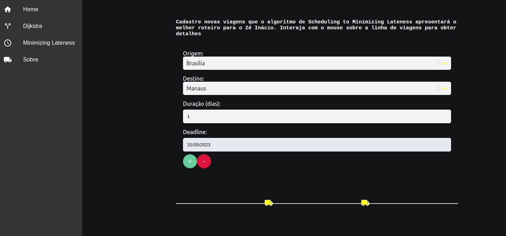
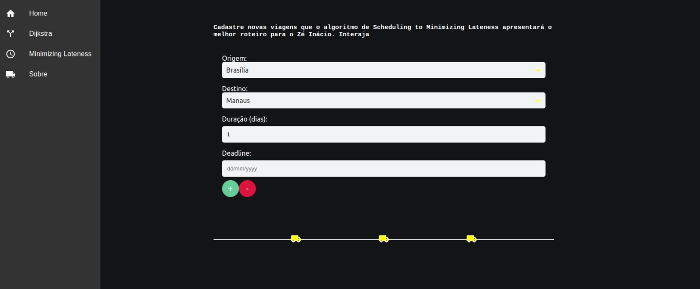
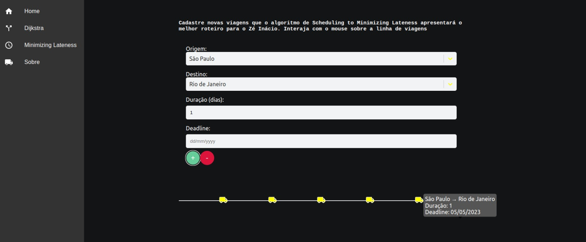

# ZeInacioTrips

**Número da Lista**: X<br>
**Conteúdo da Disciplina**: Algoritmos Ambiciosos<br>

## Alunos
|Matrícula | Aluno |
| -- | -- |
| 19/0042532  |  Felipe Alef Pereira Rodrigues |
| 18/0145509  |  Lucas Ramon Alves De Oliveira |

## Sobre 
Este projeto tem como foco principal José Inácio, um caminhoneiro dedicado que é o personagem principal desta aplicação. O objetivo é ajudá-lo a identificar o roteiro de viagem mais eficiente para evitar atrasos, levando em consideração as regras de negócio estabelecidas pela empresa Centro-Sul. Para realizar essa otimização de roteamento, a aplicação utiliza o algoritmo de Scheduling to Minimizing Lateness, uma solução comprovada para encontrar o menor atraso possível.  

## Screenshots





## Instalação 
**Linguagem**: Javascipt-JS<br>
**Framework**: react<br>

É necessário ter a versão 16 do Node.js instalada em seu sistema. Você pode baixá-la [aqui](https://nodejs.org/en/download). Se estiver utilizando o NVM a mudança para a versão correta do Node.js é ainda mais fácil. Caso tenha o nvm você pode obter a versão 16 executando o seguinte comando:
```
nvm install 16
```
Após a instalação, você pode alternar para a versão 16 do Node.js a qualquer momento com o seguinte comando:

```
nvm use 16

```

Este projeto utiliza o gerenciador de pacotes Yarn. Se você ainda não o possui, instale-o seguindo as instruções disponíveis [neste link](https://yarnpkg.com/getting-started/install).

<div style="display: inline_block" align="center"><br>
  
  
 </div> 

## Uso 
Navegue até o diretório que contém o arquivo package.json. Este arquivo define todas as dependências necessárias para o projeto.

Instale as dependências do projeto. Para isso, execute o seguinte comando no terminal:

```
yarn install

```
Após a instalação bem-sucedida das dependências, você está pronto para executar a aplicação. Para iniciar o servidor de desenvolvimento, execute o seguinte comando:

```
yarn start
```
## Outros 
Para uma melhor contextualização, recomendamos a leitura do texto na página. Na página específica, você encontrará a opinião dos estudantes sobre o desenvolvimento do projeto, bem como informações esclarecedoras sobre o personagem José Inácio. A aplicação foi cuidadosamente desenvolvida, resultando em uma apresentação visualmente agradável. Aproveite a experiência e agradecemos por avaliar o nosso projeto,camarada. :wink: :handshake: 


